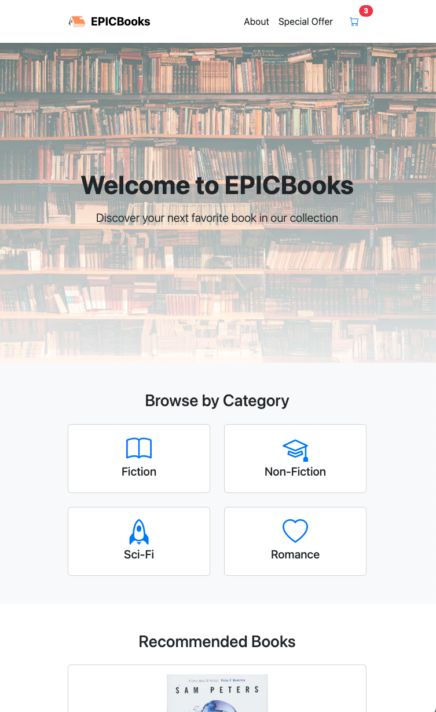

# 📚 EPICBooks

Welcome to **EPICBooks**, my ultimate online bookstore, where I offer a vast selection of literature across various genres. I created this platform to make the process of searching, browsing, and purchasing books easy and enjoyable for everyone.

<p align="center">
    
</p>

---

## 📌 Funzionalità Principali
### ✅ Ricerca avanzata
Con la mia funzione di ricerca avanzata, puoi filtrare i libri per titolo, autore e categoria, rendendo la scoperta di nuovi titoli rapida e semplice.

### 🖼️ Book Cards
Ho progettato le Book Cards in modo da offrire una presentazione visiva accattivante, completa di dettagli essenziali per ogni libro.

### 🛒 Carrello della spesa
Puoi gestire comodamente i libri nel tuo carrello. Ho incluso opzioni per aggiungere, rimuovere e visualizzare il totale dei costi prima di completare l'acquisto.

### 📩 Newsletter
Ti invito a iscriverti alla mia newsletter per ricevere aggiornamenti sui nuovi titoli, le offerte speciali e le promozioni esclusive!

### 📱 Responsive Design
La mia piattaforma è completamente ottimizzata per dispositivi mobili e desktop, offrendo un'esperienza fluida su tutte le piattaforme.

---

## 🎯 Miglioramenti Recenti
### ✨ Interfaccia utente migliorata
Ho rinnovato il design per fornire un'esperienza più moderna e intuitiva, completa di una navigazione facile e accessibile.

### 🐞 Bug fix
Ho risolto diversi problemi noti per garantire un'esperienza senza interruzioni per tutti gli utenti.

### 🏷️ Filtraggio live
I risultati di ricerca si aggiornano in tempo reale mentre digiti, semplificando ulteriormente il processo di ricerca.

---

## 🚀 Tecnologie Utilizzate
Ho utilizzato diverse tecnologie per realizzare questo progetto:
- **HTML5**: Per una struttura semantica e accessibile.
- **CSS (Bootstrap CSS)**: Stili moderni e reattivi che migliorano l'aspetto visuale complessivo.
- **JavaScript**: Per interazioni dinamiche e gestione dello stato dell'app. Ho anche approfondito concetti avanzati di JavaScript, tra cui:
  - **Design Patterns**: Strutture e metodologie per organizzare il codice in modo modulare e manutenibile.
  - **ES5 e ES6**: Fondamenti e nuove funzionalità del linguaggio.
  - **Programmazione Asincrona e AJAX**: Tecniche per sviluppare applicazioni moderne interattive.

---

## 📂 Struttura del Progetto

```

├── 📄 index.html      # Pagina principale
├── 📄 about.html      # Pagina "Chi Siamo"
├── 📄 checkout.html    # Pagina di checkout
├── 📄 js/             # Contiene i file JavaScript
│   ├── script.js      # Logica JavaScript generale
│   └── checkout.js    # Logica specifica per il checkout
├── 📄 scss/           # Contiene i file SASS
│   └── styles.scss    # Stili personalizzati per l'app
├── 📄 img/            # Immagini e risorse grafiche
└── 📄 README.md       # Documentazione del progetto

```

---

## 🖼️ Screenshot
<p align="center">
    
</p>

---

## 🔄 Aggiornamenti Futuri
- [ ] Implementazione di un sistema di recensioni per i libri.
- [ ] Integrazione con social media per facilitare la condivisione dei libri.
- [ ] Miglioramento del sistema di raccomandazione basato sugli acquisti passati degli utenti.

---

## 🤝 Contributi
Le contribuzioni sono sempre benvenute! Apri una **issue** o invia un **pull request** per suggerire modifiche.

---

## 👤 Autore
[Henry](https://github.com/henry8913)

## 📝 Licenza
Distribuito sotto licenza [MIT](https://github.com/henry8913/4_JavaScript-Advanced-CH4/blob/main/LICENSE.txt). Vedi `LICENSE` per ulteriori dettagli.
